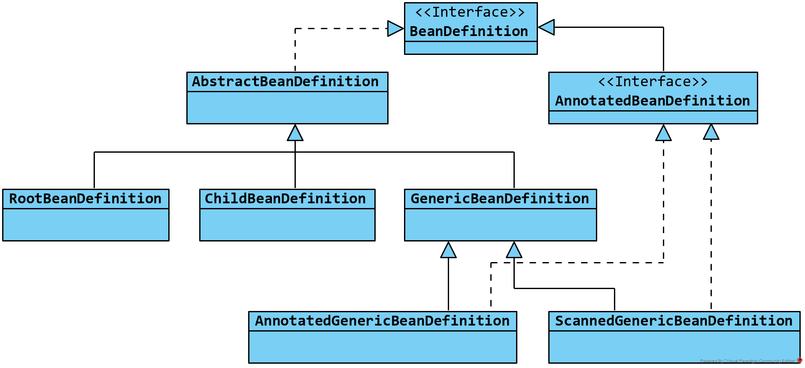
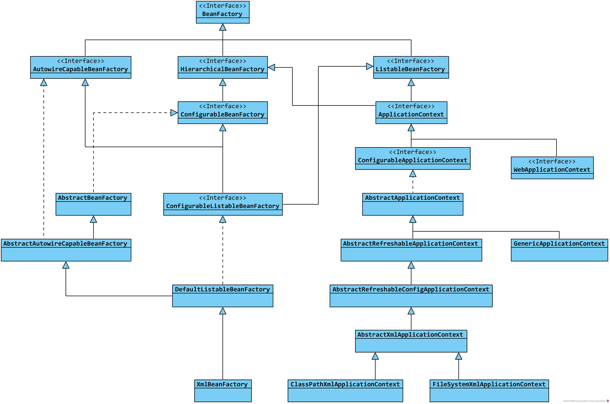
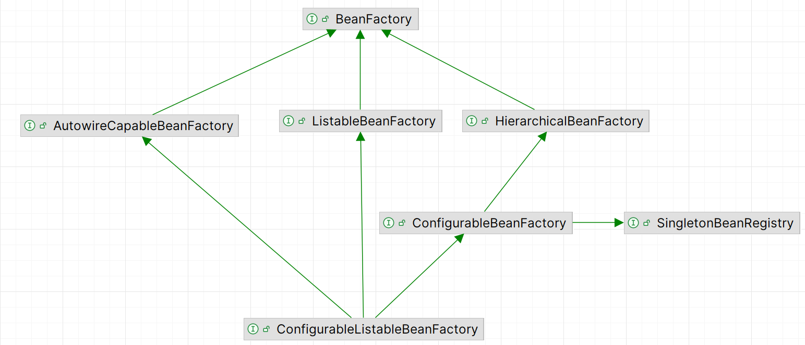

# 1. 概述
Spring中任何实现了 BeanFactory 接口的类都可以视为容器，它是 IOC 功能实现的核心，用于完成**类实例从加载到销毁的整个生命周期的控制**，这些被 spring 所管理的实例统称为 bean

根据抽象层级的不同，容器又分为 BeanFactory 的直接实现，与基于 BeanFactory 的扩展实现 ApplicationContext，后者在前者的基础继承了 ResourceLoader和EnvironmentCapable接口，因而具备从某类运行环境的资源中直接加载 bean 

ApplicationContext 最常用的两个实现 ClassPathXmlApplicationContext 和 AnnotationConfigApplicationContext 
1. 前者用于从项目路径下根据 xml 文件加载 bean，而后者通过扫描类注解完成 bean 的加载。
2. 这两者 ApplicationContext 实际上就对应了我们所熟悉的两类配置方式，前者就是传统的 xml 配置，后者则是通过 @Component 与 @Bean 等注解对 bean 进行配置

3. 
# 2. BeanFactory接口体系
总览 BeanFactory 体系，按照接口的抽象层次，大体可以分层四层:

第一层：BeanFactory 
1. 功能：定义了IoC容器最基础、最核心的职责。它只关心一件事：提供Bean，即 getBean()
2. 这是**面向“使用者”**的接口。 它为客户端（你的业务代码）提供了最简单的API，完全隐藏了容器内部的复杂性
3. 学到了接口隔离：为你的API消费者提供一个最小、最简单的接口

第二层：HierarchicalBeanFactory，ListableBeanFactory，AutowireCapableBeanFactory
1. 它们各自为BeanFactory添加了一项新的、独立的能力
2. HierarchicalBeanFactory增加了“父子容器”的层级关系、 ListableBeanFactory增加了**遍历和查询**容器中Bean的能力、 AutowireCapableBeanFactory增加了**创建和管理Bean生命周期**的能力\

第三层：ConfigurableBeanFactory，此外还有一个关联性较强SingletonBeanRegistry
1. 这是**面向“管理者”和“配置者”**的接口。它提供了配置BeanFactory本身的能力
2. 如：设置父工厂、注册作用域、注册类型转换器、注册属性编辑器、注册BeanPostProcessor等
3. 职责分离：BeanFactory面向使用者，而ConfigurableBeanFactory面向启动和配置Spring容器的代码（比如ApplicationContext）

第四层：ConfigurableListableBeanFactory\
1. 它是一个内部“超级接口”，它组合了所有职责： BeanFactory (获取Bean)、ListableBeanFactory (遍历Bean)、AutowireCapableBeanFactory (创建Bean)、ConfigurableBeanFactory (配置工厂)
2. 它定义了一个功能最强大的BeanFactory接口，Spring容器内部使用的BeanFactory通常都是ConfigurableListableBeanFactory类型
3. 在Spring启动过程中，框架需要做很多复杂的工作，比如：
- 找到所有的BeanDefinition（需要 Listable 的能力）
- 注册 BeanPostProcessor（需要 Configurable 的能力）。
- 提前实例化单例（需要 Listable + AutowireCapable 的能力）
## 2.1 BeanFactory
BeanFactory 是整个容器体系最顶层的接口，BeanFactory 定义了容器的一些基本能力:
1. 容器可以根据名称、类型、构造函数这三个要素，单独或两两组合的的获得一个 bean； 
2. 容器获取的 bean 可以是单例多种多例的； 
3. 容器中的 bean 可以拥有多个名称
```aiignore
public interface BeanFactory {
    String FACTORY_BEAN_PREFIX = "&";
    // 获取bean相关的方法
    Object getBean(String name) throws BeansException;
    <T> T getBean(String name, @Nullable Class<T> requiredType) throws BeansException;
    Object getBean(String name, Object... args) throws BeansException;
    <T> T getBean(Class<T> requiredType) throws BeansException;
    <T> T getBean(Class<T> requiredType, Object... args) throws BeansException;
    <T> ObjectProvider<T> getBeanProvider(Class<T> requiredType);
    <T> ObjectProvider<T> getBeanProvider(ResolvableType requiredType);

    // 容器 bean 属性的一些判断
    boolean containsBean(String name);
    boolean isSingleton(String name) throws NoSuchBeanDefinitionException;
    boolean isPrototype(String name) throws NoSuchBeanDefinitionException;
    boolean isTypeMatch(String name, ResolvableType typeToMatch) throws NoSuchBeanDefinitionException;
    boolean isTypeMatch(String name, @Nullable Class<?> typeToMatch) throws NoSuchBeanDefinitionException;

    // 获取 bean 在容器中的一些属性
    Class<?> getType(String name) throws NoSuchBeanDefinitionException;
    String[] getAliases(String name);
}
```
## 2.2 分层工厂，批量工厂，自动装配工厂
注：当一个类同时实现了 HierarchicalBeanFactory 和 ListableBeanFactory 接口时，ListableBeanFactory 中的方法是不会考虑到父工厂的，也就是说，spring 中的 ListableBeanFactory 接口表示的能力只针对当前实现它的类
### 2.2.1 HierarchicalBeanFactory
HierarchicalBeanFactory 接口用于表示一个多集嵌套的 BeanFactory
```aiignore
public interface HierarchicalBeanFactory extends BeanFactory {
    // 获取父工厂
    BeanFactory getParentBeanFactory();
    // 当前工厂是否存在与名称对应的 bean
    boolean containsLocalBean(String name);
}

```
### 2.2.2 ListableBeanFactory
ListableBeanFactory 接口定义了容器根据类型、名称或类上的注解**批量的获取 bean 或 bean 名称**的能力
```aiignore
public interface ListableBeanFactory extends BeanFactory {
    // 容器中是否存在 bean
    boolean containsBeanDefinition(String beanName);
    // 容器中定义了多少 bean
    int getBeanDefinitionCount();
    // 获取容器中所有定义了的 bean 名称
    String[] getBeanDefinitionNames();
    
    // 根据类型批量获取 bean
    String[] getBeanNamesForType(ResolvableType type);
    String[] getBeanNamesForType(ResolvableType type, boolean includeNonSingletons, boolean allowEagerInit);
    String[] getBeanNamesForType(@Nullable Class<?> type);
    String[] getBeanNamesForType(@Nullable Class<?> type, boolean includeNonSingletons, boolean allowEagerInit);
    <T> Map<String, T> getBeansOfType(@Nullable Class<T> type) throws BeansException;
    <T> Map<String, T> getBeansOfType(@Nullable Class<T> type, boolean includeNonSingletons, boolean allowEagerInit) throws BeansException;
    
    // 根据类上的注解获取 bean
    String[] getBeanNamesForAnnotation(Class<? extends Annotation> annotationType);
    Map<String, Object> getBeansWithAnnotation(Class<? extends Annotation> annotationType) throws BeansException;
    <A extends Annotation> A findAnnotationOnBean(String beanName, Class<A> annotationType) throws NoSuchBeanDefinitionException;
}

```
### 2.2.2 AutowireCapableBeanFactory
AutowireCapableBeanFactory为容器关联的 bean 提供自动装配功能
```aiignore
public interface AutowireCapableBeanFactory extends BeanFactory {
    
    // 自动装配方式
	int AUTOWIRE_NO = 0; // 不自动装配
	int AUTOWIRE_BY_NAME = 1; // 根据bean名称自动装配
	int AUTOWIRE_BY_TYPE = 2; // 根据bean类型自动装配
	int AUTOWIRE_CONSTRUCTOR = 3; // 根据bean的构造方法自动装配
	int AUTOWIRE_AUTODETECT = 4; // 根据反射信息自动选择合适的方式自动装配，spring3 以后不再推荐该方式
	String ORIGINAL_INSTANCE_SUFFIX = ".ORIGINAL";
    
    // bean的创建与装配相关的方法
	<T> T createBean(Class<T> beanClass) throws BeansException;
	void autowireBean(Object existingBean) throws BeansException;
	Object configureBean(Object existingBean, String beanName) throws BeansException;
    
    // bean 声明周期相关的方法
	Object createBean(Class<?> beanClass, int autowireMode, boolean dependencyCheck) throws BeansException;
	Object autowire(Class<?> beanClass, int autowireMode, boolean dependencyCheck) throws BeansException;
	void autowireBeanProperties(Object existingBean, int autowireMode, boolean dependencyCheck) throws BeansException;
	void applyBeanPropertyValues(Object existingBean, String beanName) throws BeansException;
	Object initializeBean(Object existingBean, String beanName) throws BeansException;
	Object applyBeanPostProcessorsBeforeInitialization(Object existingBean, String beanName) throws BeansException;
	Object applyBeanPostProcessorsAfterInitialization(Object existingBean, String beanName) throws BeansException;
	void destroyBean(Object existingBean);
    
    // 获取 bean 依赖的相关方法
	<T> NamedBeanHolder<T> resolveNamedBean(Class<T> requiredType) throws BeansException;
	Object resolveBeanByName(String name, DependencyDescriptor descriptor) throws BeansException;
	Object resolveDependency(DependencyDescriptor descriptor, @Nullable String requestingBeanName) throws BeansException;
	Object resolveDependency(DependencyDescriptor descriptor, @Nullable String requestingBeanName, @Nullable Set<String> autowiredBeanNames, @Nullable TypeConverter typeConverter) throws BeansException;
}

```
## 2.3 分层配置工厂
### 2.3.1 SingletonBeanRegistry接口
SingletonBeanRegistry 接口定义了容器**根据名称注册或获取 bean 单例**的能力
```aiignore
public interface SingletonBeanRegistry {
    void registerSingleton(String beanName, Object singletonObject);
    Object getSingleton(String beanName);
    boolean containsSingleton(String beanName);
    String[] getSingletonNames();
    int getSingletonCount();
    Object getSingletonMutex();
}
```
### 2.3.2 ConfigurableBeanFactory接口
BeanFactory 的三级接口为 ConfigurableBeanFactory，它实现了 HierarchicalBeanFactory 和 SingletonBeanRegistry接口
1. 它是一个可配置的 BeanFactory，它不仅支持 BeanFactory 分层，还支持以单例的方式操作 bean
2. spring 通过该接口规定了一个 BeanFactory 应该具备以及可以从中获取哪些可配置的组件与参数
3. ConfigurableBeanFactory 主要定义了以下几类能力:
   - **作用域的注册与获取**: spring 中默认提供了 singleton 和 prototype 两种作用域，除此之外还可以通过 ConfigurableBeanFactory 接口注册自定义的作用域
   - **类型转换器的注册与获取**: spring 中的类型转换器用于完成 bean 属性值的类型转换工作
   - **属性编辑器的注册与获取**: spring 中的属性编辑器用于完成 bean 属性值的编辑工作
   - **bean 后置处理器的注册与获取**: spring 中的 bean 后置处理器用于在 bean 初始化前后对 bean 进行加工处理
   - **容器事件广播器的注册与获取**: spring 中的容器事件广播器用于完成容器事件的发布与监听工作
   - **其他配置参数的设置与获取**: spring 中还可以通过 ConfigurableBeanFactory 接口设置一些其他配置参数，比如是否允许循环依赖、是否允许缓存 bean 元信息等
4. 按照用途来说，该接口的API分为三类 
    - **bean 的管理方法**：包括 bean 依赖状态与生命周期的获取，bean 的销毁，bean 作用域域、定义信息与别名的操作； 
   - **bean 创建过程中使用组件的配置**：包括字符串解析器，类加载器，类型转换器，属性注册表，bean 的后置处理器等组件的配置； 
   - **工厂本身状态的一些操作**：包括父工程配置，工厂间依赖的拷贝，以及访问控制等
```aiignore
public interface ConfigurableBeanFactory extends HierarchicalBeanFactory, SingletonBeanRegistry {
	String SCOPE_SINGLETON = "singleton"; // 单例
	String SCOPE_PROTOTYPE = "prototype"; // 多例

	// 配置父工厂
	void setParentBeanFactory(BeanFactory parentBeanFactory) throws IllegalStateException;
	
	// 配置类加载器
	void setBeanClassLoader(@Nullable ClassLoader beanClassLoader);
	ClassLoader getBeanClassLoader();
	void setTempClassLoader(@Nullable ClassLoader tempClassLoader);
	ClassLoader getTempClassLoader();
	
	// 配置bean元信息缓存
	void setCacheBeanMetadata(boolean cacheBeanMetadata);
	boolean isCacheBeanMetadata();
	
	// 配置bean配置的表达式解析器，用于提供@Value值注册等功能
	void setBeanExpressionResolver(@Nullable BeanExpressionResolver resolver);
	BeanExpressionResolver getBeanExpressionResolver();
	
	// 配置类型转换器
	void setConversionService(@Nullable ConversionService conversionService);
	ConversionService getConversionService();
	void setTypeConverter(TypeConverter typeConverter);
	TypeConverter getTypeConverter();
	
	// 配置属性注册表
	void addPropertyEditorRegistrar(PropertyEditorRegistrar registrar);
	void registerCustomEditor(Class<?> requiredType, Class<? extends PropertyEditor> propertyEditorClass);
	void copyRegisteredEditorsTo(PropertyEditorRegistry registry);
	
	// 配置字符串解析器，用于提供解析xml中的bean属性的表达式等功能
	void addEmbeddedValueResolver(StringValueResolver valueResolver);
	boolean hasEmbeddedValueResolver();
	String resolveEmbeddedValue(String value);
	
	// 配置bean的后置处理器BeanPostProcessor
	void addBeanPostProcessor(BeanPostProcessor beanPostProcessor);
	int getBeanPostProcessorCount();

	// 配置bean的作用域，接口中已经默认提供了单例或多例的scopeName
	void registerScope(String scopeName, Scope scope);
	String[] getRegisteredScopeNames();
	Scope getRegisteredScope(String scopeName);

	// 配置访问控制
	AccessControlContext getAccessControlContext();

	// 从其他的工厂复制配置
	void copyConfigurationFrom(ConfigurableBeanFactory otherFactory);

	// 给指定的bean注册别名
	void registerAlias(String beanName, String alias) throws BeanDefinitionStoreException;
	void resolveAliases(StringValueResolver valueResolver);
	
	// 合并bean的定义信息
	BeanDefinition getMergedBeanDefinition(String beanName) throws NoSuchBeanDefinitionException;

	// 是否是工厂bean
	boolean isFactoryBean(String name) throws NoSuchBeanDefinitionException;
	
	// 设置bean的创建状态，管理bean的依赖与被依赖关系，用于处理循环依赖等问题
	void setCurrentlyInCreation(String beanName, boolean inCreation);
	boolean isCurrentlyInCreation(String beanName);
	void registerDependentBean(String beanName, String dependentBeanName);
	String[] getDependentBeans(String beanName);
	String[] getDependenciesForBean(String beanName);

	// bean的销毁相关方法
	void destroyBean(String beanName, Object beanInstance);
	void destroyScopedBean(String beanName);
	void destroySingletons();
}

```
## 2.4 批量分层配置工厂
ConfigurableListableBeanFactory 是 BeanFactory 体系的第四级接口，也是最后一级接口。它继承了 ConfigurableBeanFactory、ListableBeanFactory与AutowireCapableBeanFactory 接口，因此它具备到目前为止 BeanFactory 前三级接口定义的全部能力

它表示了一个**可以配置的，允许按单例或多例操作 bean，支持自动装配 bean，并且可以根据 bean 的名称、类型或者类上注解批量获取 bean**的超级 bean 工厂

在上述功能的基础上，又针对各接口提供的功能定义了一些新的补充方法
```aiignore
public interface ConfigurableListableBeanFactory extends ListableBeanFactory, AutowireCapableBeanFactory, ConfigurableBeanFactory {
    // 自动装配相关配置
    void ignoreDependencyType(Class<?> type);
    void ignoreDependencyInterface(Class<?> ifc);
    void registerResolvableDependency(Class<?> dependencyType, @Nullable Object autowiredValue);
    boolean isAutowireCandidate(String beanName, DependencyDescriptor descriptor) throws NoSuchBeanDefinitionException;
    
    // 获取bean的定义信息
    BeanDefinition getBeanDefinition(String beanName) throws NoSuchBeanDefinitionException;
    
    // 获取已经定义的bean名称的迭代器
    Iterator<String> getBeanNamesIterator();
    // 清除bean元信息缓存
    void clearMetadataCache();
    
    // 冻结配置，冻结后工厂的配置不允许进一步修改
    void freezeConfiguration();
    boolean isConfigurationFrozen();
    
    // 实例化所有未实例化的单例bean
    void preInstantiateSingletons() throws BeansException;
}
```
#3. ApplicationContext 接口体系
ApplicationContext 接口体系是 BeanFactory 接口体系的扩展，ApplicationContext 继承了 BeanFactory 接口，并且**扩展**资源加载与环境感知的能力

ApplicationContext 有 web 环境上下文与非 web 环境上下文的两个实现体系，单纯按接口层次分为三层：\
第一层：ApplicationContext \
第二层：WebApplicationContext 和 ConfigurableApplicationContext \
第三层：ConfigurableApplicationContext 

## 3.1 ApplicationContext接口
ApplicationContext 它同时实现了 EnvironmentCapable，ListableBeanFactory，HierarchicalBeanFactory，MessageSource，ApplicationEventPublisher 以及 ResourcePatternResolver 接口。相较 BeanFactory ，它的功能要更加强大\
1. HierarchicalBeanFactory 与 ListableBeanFactory：提供像 BeanFactory 一样操作 bean 的功能；\
2. ApplicationEventPublisher：提供向监听器发布事件的能力；\
3. ResourcePatternResolver 与 EnvironmentCapable：提供选择性的某个特定环境的文件资源中加载配置的能力；\
4. MessageSource：提供解析消息并支持国际化配置的能力；

**ApplicationContext 用于提供 spring 程序在某个特定环境运行时所具备的全部信息的“上下文”对象**
```aiignore
public interface ApplicationContext extends EnvironmentCapable, ListableBeanFactory, HierarchicalBeanFactory, MessageSource, ApplicationEventPublisher, ResourcePatternResolver {
    // 获取上下文id
    String getId();
    // 获取对应应用程序名称
    String getApplicationName();
    // 获取上下文的展示名称
    String getDisplayName();
    // 获取容器被启动的时间
    long getStartupDate();
    // 获取父级上下文
    ApplicationContext getParent();
    // 获取自动装配bean工厂
    AutowireCapableBeanFactory getAutowireCapableBeanFactory() throws IllegalStateException;
}
```
## 3.2 web 应用上下文与可配置上下文
### 3.2.1 ConfigurableApplicationContext接口
ConfigurableApplicationContext 表示一个可以配置的上下文容器，与 WebApplicationContext 不同，它提供了一些参数和属性的配置方法：

它有一个通用可配置上下文的实现类：GenericApplicationContext，在非 web 环境中，该实现类的两个子类是最经常用到的：
1. GenericXmlApplicationContext：基于 xml 配置文件配置的上下文；
2. AnnotationConfigApplicationContext：基于注解配置的上下文
```aiignore
public interface ConfigurableApplicationContext extends ApplicationContext, Lifecycle, Closeable {
    
    String CONFIG_LOCATION_DELIMITERS = ",; \t\n";
    String CONVERSION_SERVICE_BEAN_NAME = "conversionService";
    String LOAD_TIME_WEAVER_BEAN_NAME = "loadTimeWeaver";
    String ENVIRONMENT_BEAN_NAME = "environment";
    String SYSTEM_PROPERTIES_BEAN_NAME = "systemProperties";
    String SYSTEM_ENVIRONMENT_BEAN_NAME = "systemEnvironment";
    String SHUTDOWN_HOOK_THREAD_NAME = "SpringContextShutdownHook";
    
    // 配置上下文的id
    void setId(String id);
    // 配置上下文父容器
    void setParent(@Nullable ApplicationContext parent);
    
    // 配置上下文允许环境
    void setEnvironment(ConfigurableEnvironment environment);
    @Override
    ConfigurableEnvironment getEnvironment();
    
    // 获取bean后置处理器
    void addBeanFactoryPostProcessor(BeanFactoryPostProcessor postProcessor);
    
    // 添加一个应用监听器，用于监听ApplicationEventPublisher发布的事件
    void addApplicationListener(ApplicationListener<?> listener);
    
    // 配置类加载器
    void setClassLoader(ClassLoader classLoader);
    
    // 配置资源协议处理器
    void addProtocolResolver(ProtocolResolver resolver);
    
    // 刷新配置
    void refresh() throws BeansException, IllegalStateException;
    
    // 关闭此上下文容器时的回调函数
    void registerShutdownHook();
    
    // 关闭上下文容器，并释放资源
    void close();
    
    // 当前容器是否已经调用过refresh()，并且尚未关闭
    boolean isActive();
    
    // 获取bean工厂
    ConfigurableListableBeanFactory getBeanFactory() throws IllegalStateException;

}

```
### 3.2.2 WebApplicationContext接口
WebApplicationContext 是 web 环境的上下文，该上下文几乎没有可配置项，主要用于配置 Servlet 上下文
```aiignore
public interface WebApplicationContext extends ApplicationContext {
    String ROOT_WEB_APPLICATION_CONTEXT_ATTRIBUTE = WebApplicationContext.class.getName() + ".ROOT";
    
    // 作用域
    String SCOPE_REQUEST = "request";
    String SCOPE_SESSION = "session";
    String SCOPE_APPLICATION = "application";
    
    // 固定的bean名称
    String SERVLET_CONTEXT_BEAN_NAME = "servletContext";
    String CONTEXT_PARAMETERS_BEAN_NAME = "contextParameters";
    String CONTEXT_ATTRIBUTES_BEAN_NAME = "contextAttributes";
    
    // 获取ServletContext
    ServletContext getServletContext();

}

```
## 3.3 ConfigurableApplicationContext接口
ConfigurableApplicationContext 接口同时继承了 WebApplicationContext 和 ConfigurableApplicationContext，代表了一个可以配置的 web 上下文容器
```aiignore
public interface ConfigurableWebApplicationContext extends WebApplicationContext, ConfigurableApplicationContext {

	String APPLICATION_CONTEXT_ID_PREFIX = WebApplicationContext.class.getName() + 
	String SERVLET_CONFIG_BEAN_NAME = "servletConfig";

	// 配置Servlet容器
	void setServletContext(@Nullable ServletContext servletContext);
	void setServletConfig(@Nullable ServletConfig servletConfig);
	@Nullable
	ServletConfig getServletConfig();

    // 设置命名空间
	void setNamespace(@Nullable String namespace);
	@Nullable
	String getNamespace();
	
	// 设置配置文件的路径，比如WEB-INF
	void setConfigLocation(String configLocation);
	void setConfigLocations(String... configLocations);
	@Nullable
	String[] getConfigLocations();

}
```
# 4. 小结
在 spring 中，容器分为两大类：BeanFactory 和 ApplicationContext。
## BeanFactory
其中，BeanFactory 是纯粹的用于管理 bean 对象生命周期的容器，它的接口体系分为四层： 
1. BeanFactory 接口本身，是容器的最高层抽象； 
2.  第二层
-  HierarchicalBeanFactory ：分层工厂，表示一个存在层级关系的容器
- ListableBeanFactory：批量工厂，表示一个允许根据名称、类型或类注解等属性批量的操作 bean 的容器
- AutowireCapableBeanFactory：自动装配工厂，表示一个可以关联需要自动装配的 bean 的容器；
3. ConfigurableBeanFactory：分层配置工厂 ，是 HierarchicalBeanFactory 和 SingletonBeanRegistry 接口的组合，表示一个分层的、可以以单例模式操作 bean，并且允许调整配置的容器； 
4. ConfigurableListableBeanFactory：可配置的批量工厂，是ConfigurableBeanFactory 与 AutowireCapableBeanFactory 接口的组合，具备 BeanFactory 体系中的全部能力。

## ApplicationContext

ApplicationContext 是基于 BeanFactory 的扩展，它实现了其他的接口，因此具有一些 BeanFactory 不具备的功能：
1. ApplicationEventPublisher：提供向监听器发布事件的功能； 
2. ResourcePatternResolver 与 EnvironmentCapable：提供选择性的某个特定环境的文件资源中加载配置的功能； 
3. MessageSource：提供解析消息并支持国际化配置的功能；

从层次来说，ApplicationContext 主要分为三层：
1. ApplicationContext 接口本身，是基于 BeanFactory 接口的扩展，是整个应用上下文体系的最顶层接口； 
2. WebApplicationContext：web 应用上下文，用于承载 ServletContext； ConfigurableApplicationContext：用于非 web 环境下的可配置应用上下文； 
3. ConfigurableApplicationContext：可配置的 web 应用上下文，同时继承了 WebApplicationContext 和 ConfigurableApplicationContext 接口，代表了一个可以配置的 web 上下文容器。

## 学习
如何设计一个复杂但可扩展的系统：

### 接口隔离原则 (ISP)：
核心： 不要有“胖接口”，而是要有很多“小而专”的接口\
实践： Spring将BeanFactory的职责拆分为：
1. 基础获取(BeanFactory)
2. 层级(Hierarchical...)
3. 列表查询(Listable...)
4. 创建与装配(AutowireCapable...)
5. 配置(Configurable...)
6. 单例管理(SingletonBeanRegistry)

### 基于角色的API设计 (Role-Based API)：
核心： 为不同的“角色”提供不同的API视图\
实践：
1. 给Bean使用者（业务代码）提供 BeanFactory。
2. 给Bean管理者（ApplicationContext）提供 ConfigurableListableBeanFactory。
3. 给框架扩展者（如Spring Batch/Data）提供 ListableBeanFactory 来查询特定Bean。

### 隐藏复杂性 (Encapsulation)：
核心： 将最简单的接口暴露给用户，将最复杂的接口留给内部\
实践： BeanFactory 是最简单的，而ConfigurableListableBeanFactory 是最复杂的，但它只在内部使用。这使得框架易于使用，同时保持了内部的强大和灵活。

### 组合优于继承 (Composition over Inheritance)：
核心： 尽管这里用了接口继承，但其思想是“组合”能力。
实践： ConfigurableListableBeanFactory 不是通过继承一个巨大的类来实现的，而是通过“组合”（继承）多个单一职责的接口来实现的。这使得实现类（如DefaultListableBeanFactory）的职责非常清晰，它必须实现所有这些接口的功能


## 接口 -> 抽象类 -> 具体类 

这是一种极其优秀、极其经典的设计模式，它是“模板方法模式”和“接口隔离原则”的完美结合。

Interface (接口)：定义“契约” (What)
1. 它只定义“你能做什么”，比如BeanFactory 定义了 getBean。 
2. 好处： 彻底解耦。所有代码都应该依赖这个接口，而不是依赖具体实现。这让替换实现成为可能。

Abstract Class (抽象类)：定义“骨架” (How - Shared Logic)
1. 它为接口提供一个通用的、固定的算法骨架（模板方法）。比如 AbstractBeanFactory 实现了 getBean 的流程。
2. 它把易变的部分（比如去哪找定义、如何创建）定义为abstract方法，交给子类去实现。
3. 好处： 代码复用。所有子类都自动继承了这个核心流程，不需要重复编写，保证了核心逻辑的统一和稳定。

Concrete Class (具体类)：定义“细节” (How - Specifics)
1. 它的唯一职责就是“填空”——实现抽象类中未实现的 abstract 方法。 
2. 比如 DefaultListableBeanFactory 实现了 getBeanDefinition，告诉骨架：“去Map里找！” 
3. 好处： 扩展性。你可以有多个具体类，提供不同的“填空”策略（比如一个从Map读，一个从数据库读），但它们都能完美地在Abstract Class的骨架下工作。

### 示例：
目标： 要设计一个电商的“订单服务”。我们知道现在有“普通订单”和“VIP订单”（后续可能还有“企业订单”、“秒杀订单”等）

面临的问题是：

所有订单的创建流程（校验、计价、入库、通知）是相似的。我们不想在VipOrderService和NormalOrderService里把“保存数据库”和“发通知”的代码各写一遍，这会造成代码重复，未来修改会非常痛苦。

不同订单的“校验规则”和“价格计算”是不同的。VIP订单要校验会员资格，计价要打8折；普通订单则不需要。

未来我们一定会加入新的订单类型（比如CorporateOrderService），我们希望增加新类型时，不要去修改已经写好的VipOrderService和NormalOrderService的代码，更不要去改动核心的OrderController

第一步：定义 Interface (接口) - 制定“契约”

```aiignore
public interface OrderService {
void createOrder(Order data);
}
```
这是给系统的调用者（比如OrderController）看的。 它定义了一个最小化的契约：“我不管你是谁，你必须提供一个createOrder的功能”。 
1. 解耦：OrderController只需要面向这个接口编程
2. 多态：orderService这个变量，在运行时既可以指向一个NormalOrderService实例，也可以指向一个VipOrderService实例。Controller的代码完全不需要改变

第二步：定义 Abstract Class (抽象类) - 搭建“稳定骨架”
```aiignore
public abstract class AbstractOrderService implements OrderService {

    /**
     * 这是“模板方法”，它定义了算法的“骨架”
     * 1. final：子类不能重写这个流程！保证了流程的稳定性。
     * 2. public：这是暴露给接口的实现。
     */
    @Override
    public final void createOrder(Order data) {
        
        // 步骤1：参数校验 (易变点)
        checkParameters(data); 
        
        // 步骤2：价格计算 (易变点)
        double price = calculatePrice(data); 
        data.setPrice(price); // 设置计算后的价格

        // 步骤3：保存到数据库 (稳定点)
        saveToDB(data, price); 
        
        // 步骤4：发送通知 (稳定点)
        sendNotification(data); 
    }

    // ========== 抽象方法 (易变点 / 扩展点) ==========
    // 这两个方法，抽象类自己不知道如何实现，必须由子类去“填空”
    
    /**
     * 扩展点1：校验参数
     */
    protected abstract void checkParameters(Order data);
    
    /**
     * 扩展点2：计算价格
     */
    protected abstract double calculatePrice(Order data);


    // ========== 通用方法 (稳定点 / 复用点) ==========
    // 这两个方法是所有子类共享的，在父类实现，避免代码重复
    
    private void saveToDB(Order data, double price) {
        System.out.println("【通用逻辑】订单已保存到数据库... 价格：" + price);
        // ... 复杂的数据库操作 ...
    }
    
    private void sendNotification(Order data) {
        System.out.println("【通用逻辑】已发送通知给用户：" + data.getUserId());
        // ... 复杂的MQ/短信通知 ...
    }
}
```
它使用模板方法模式 (Template Method Pattern) 定义了createOrder这个核心流程的算法骨架
1. 核心流程稳定：我们把createOrder方法用final标记（可选，但推荐），意味着所有子类都必须遵循“校验 -> 计价 -> 保存 -> 通知”这个4步顺序，谁也不能篡改这个核心流程。这就是你说的“核心流程稳定” 
2. 代码复用：最重要的一点！saveToDB和sendNotification是所有订单都一样的“通用逻辑”。我们把它们实现在抽象类里，所有子类（VipOrderService, NormalOrderService等）就自动继承了这些能力，无需重复编写
3. 定义扩展点：checkParameters和calculatePrice是“易变逻辑”。父类不知道怎么做，所以把它们定义为abstract（抽象的）。这就等于给子类划定了范围：“你们必须实现这两个方法，用你们自己的方式”。这就是你说的“扩展点清晰”

第三步：定义 Concrete Class (具体类) - 填充“细节”
```aiignore
// 普通订单服务
public class NormalOrderService extends AbstractOrderService{
    @Override
    protected void checkParameters(Order data) {
        System.out.println("【普通订单】执行基本参数校验...");
        if (data.getUserId() == null) {
            throw new RuntimeException("用户ID不能为空");
        }
    }

    @Override
    protected double calculatePrice(Order data) {
        System.out.println("【普通订单】按原价计算...");
        return data.getOriginalPrice(); // 原价
    }
}
// VIP订单服务
public class VipOrderService extends AbstractOrderService{}
// 企业订单
public class CorporateOrderService extends AbstractOrderService{}

```
好处：
1. 职责单一：NormalOrderService的作者只关心“普通订单的校验和计价”，他完全不需要关心“如何保存数据库”和“如何发通知”（因为父类已经搞定了）
2. 灵活扩展：“对扩展开放，对修改关闭”原则，新增订单类型时，只需要新增一个Concrete Class，填充校验和计价逻辑即可，完全不需要修改已有代码，避免引入新bug
3. 代码复用：所有订单类型都自动继承了AbstractOrderService的


 


